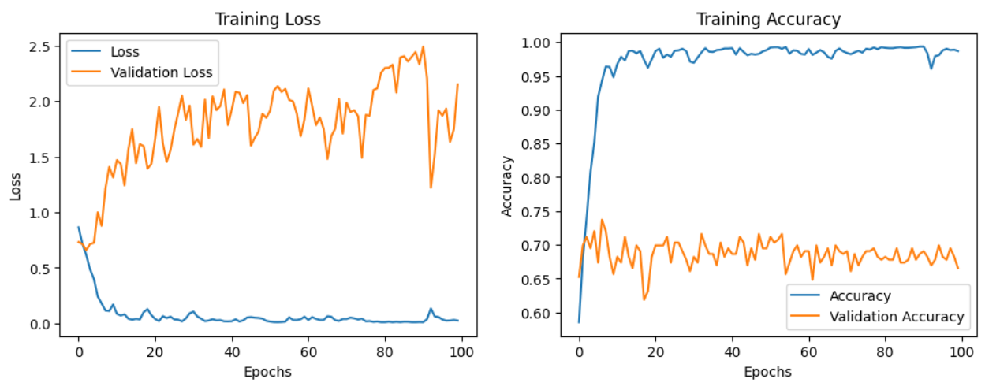
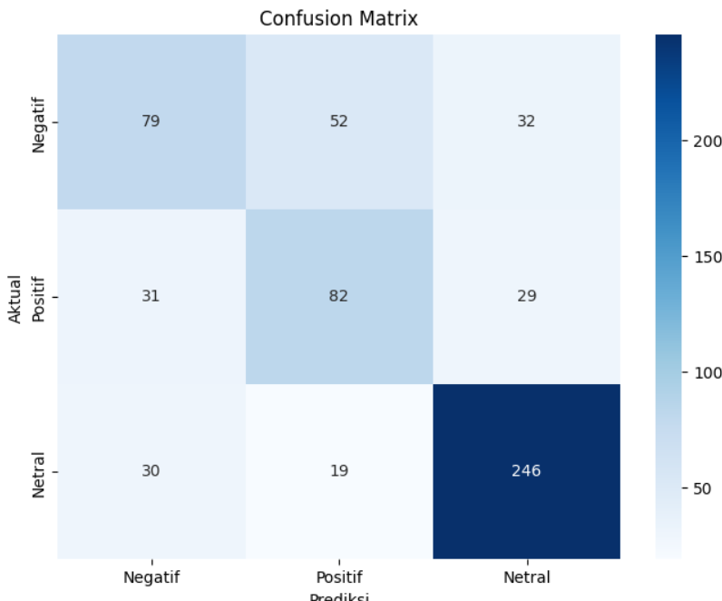
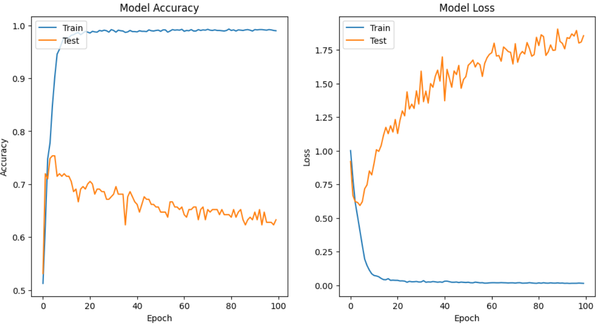
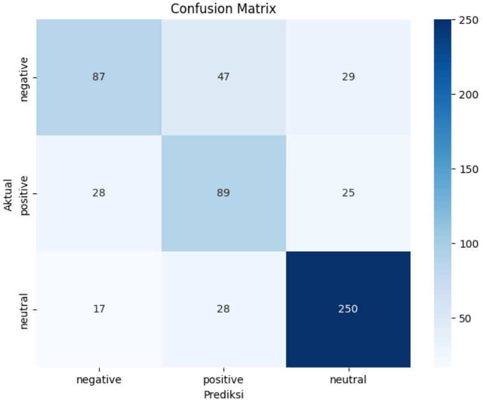

# Sentiment Analysis for Indonesian Presidential Election 2024

## Introduction
In the context of the 2024 Indonesian presidential election, understanding public sentiment towards presidential candidates is crucial for comprehending political dynamics and voter preferences. Social media has become the main arena for citizens to express their opinions and reactions to political issues and public figures. This repository leverages big data analysis to gain insights into how various narratives and issues influence public sentiment.

## Data Source
The data for this analysis was obtained from Twitter using Twitter Auth Token between January 1 and October 31, 2023. We collected 8,407 tweets in real-time based on specific keywords for each presidential candidate. These tweets were then processed and divided, with each candidate pair receiving 1,000 random tweets.

## Data Processing
The data processing began with data cleaning to eliminate duplicates and handle null values. Steps :
1. Duplicate Elimination: Remove duplicate tweets to ensure uniqueness.
2. Null Value Handling: Remove or impute missing values.
3. Conversion of Emoticons and Emojis: Convert emoticons and emojis into their text equivalents.
4. Normalization: Replace slang and non-standard words with their standard forms.
5. Stopword Removal and Stemming: Remove common stopwords and apply stemming to reduce words to their base forms.

## Models Used
We applied various methods to analyze sentiment related to presidential candidates:
1. BERT-base-multilingual:
   Uses the Transformer architecture trained on multiple languages.
2. Decision Tree:
   Constructs a decision tree based on informative features for classification.
3. Random Forest:
   An ensemble model combining predictions from multiple decision trees to improve accuracy and reduce overfitting.
4. LSTM (Long Short-Term Memory):
   An RNN designed to learn long-term dependencies in sequence data, suitable for text analysis considering word order.

## Results
| Model                   | Accuracy |
|-------------------------|----------|
| BERT-base-multilingual  | 0.69     |
| Decision Tree           | 0.68     |
| Random Forest           | 0.71     |
| LSTM                    | 0.64     |

### Training and Validation Curves for BERT Model

Below are the training loss and accuracy plots for the BERT model.

### Confusion Matrix for Decision Tree Model

Below is the confusion matrix for the Decision Tree model.

### Training and Validation Curves for LSTM Model

Below are the training accuracy and loss plots for the LSTM model.

### Confusion Matrix for Random Forest Model

Below is the confusion matrix for the Random Forest model.

## Conclusion
- Sentiment analysis provides an initial overview of the election results; positive sentiment indicates support, while negative sentiment shows challenges.
- Word Cloud from sentiment analysis reveals key issues, allowing for the adjustment of communication strategies based on public discussions.
- Random Forest and BERT-base-multilingual are the best models for sentiment analysis, offering high accuracy and a deep understanding of language context.

## Technologies Used
- Python
- TensorFlow
- Keras
- NumPy
- Pandas
- Scikit-Learn
- Seaborn
- Matplotlib

## Contributing
Clarissa Sanindita R

Alviatul Nazila

Fildzah Latifah
